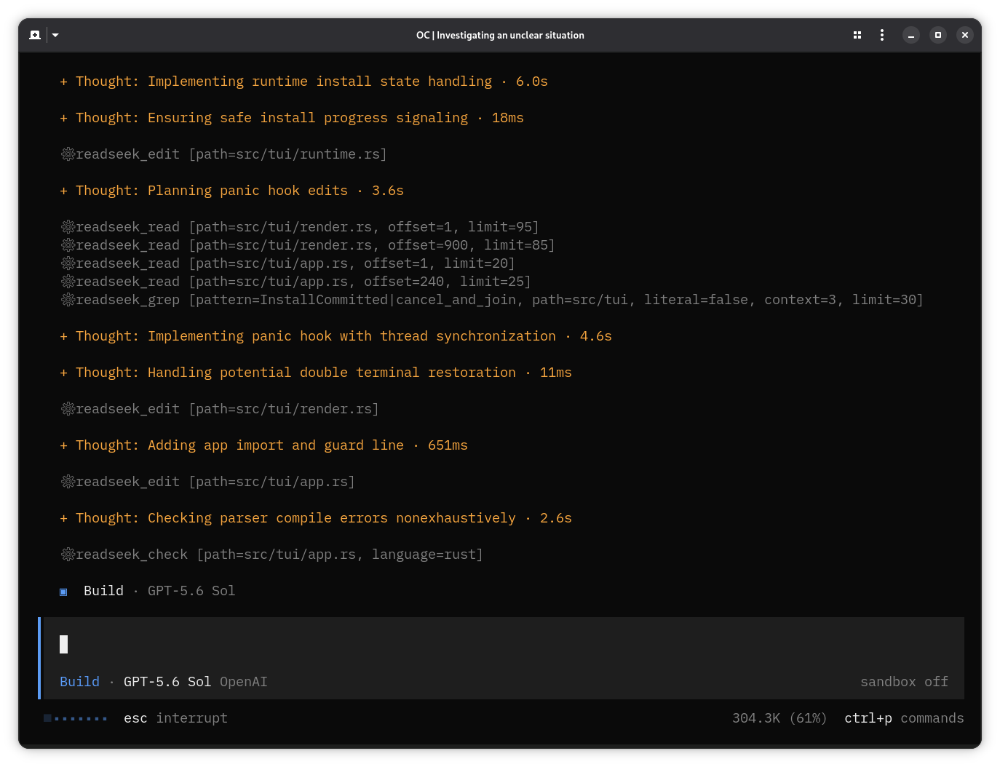

# opencode-readseek



`opencode-readseek` adds ReadSeek's anchored file tools, structural search, and
symbol navigation to OpenCode.

## Installation

Add the plugin to `opencode.json`:

```json
{
  "plugin": ["opencode-readseek"]
}
```

OpenCode installs the package and its platform-specific `@jarkkojs/readseek`
binary dependency with Bun.

## Tools

- `readseek_read`: reads anchored text; PDFs select one page by default.
- `readseek_edit`: applies hash-verified edits to existing text files.
- `readseek_write`: creates or replaces complete files.
- `readseek_grep`: searches text or regular expressions and returns anchors.
- `readseek_map`, `readseek_search`: map symbols and search AST patterns.
- `readseek_def`, `readseek_refs`, `readseek_hover`: navigate symbols.
- `readseek_rename`: applies verified renames by default. Set `apply: false` for a
  dry run.
- `readseek_check`: reports parse diagnostics.
- `readseek_view`: indexes a PDF or narrows an existing index by page, node, kind,
  or depth.

The plugin requests read, grep, external-directory, and edit permissions as needed.
File changes invalidate remembered anchors. Compaction state retains fresh paths
and pending rename plans. Text reads return at most 2,000 lines by default.

OpenCode is instructed to prefer ReadSeek's read, edit, write, and rename tools;
built-in tools remain available as fallbacks.

## Configuration

Pass options with OpenCode's plugin tuple syntax:

```json
{
  "plugin": [["opencode-readseek", { "imageMode": "auto" }]]
}
```

`imageMode` defaults to `"auto"`, exposing `none`, `all`, `ocr`, `caption`, and
`objects`. `"on"` omits `none`; `"off"` skips images and PDFs. Omitting `image`
also skips visual files.

## Licensing

`opencode-readseek` is licensed under
[Apache-2.0](https://github.com/jarkkojs/readseek/blob/main/LICENSE-APACHE-2.0).
`@jarkkojs/readseek` is licensed separately under
`Apache-2.0 AND LGPL-2.1-or-later`.
